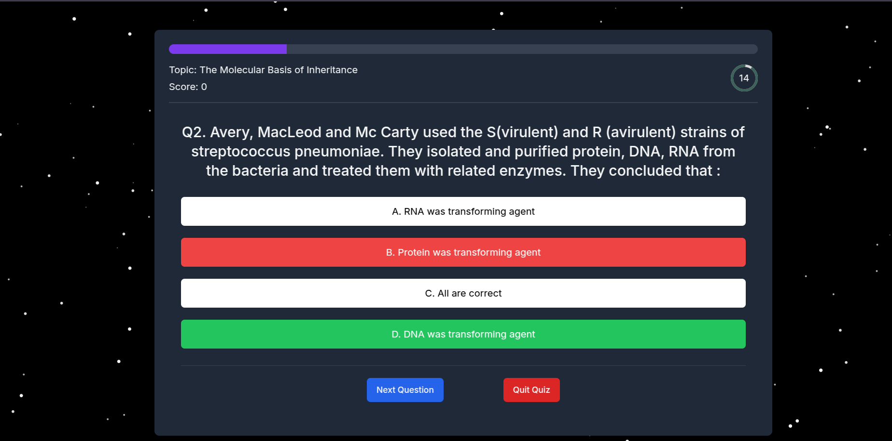
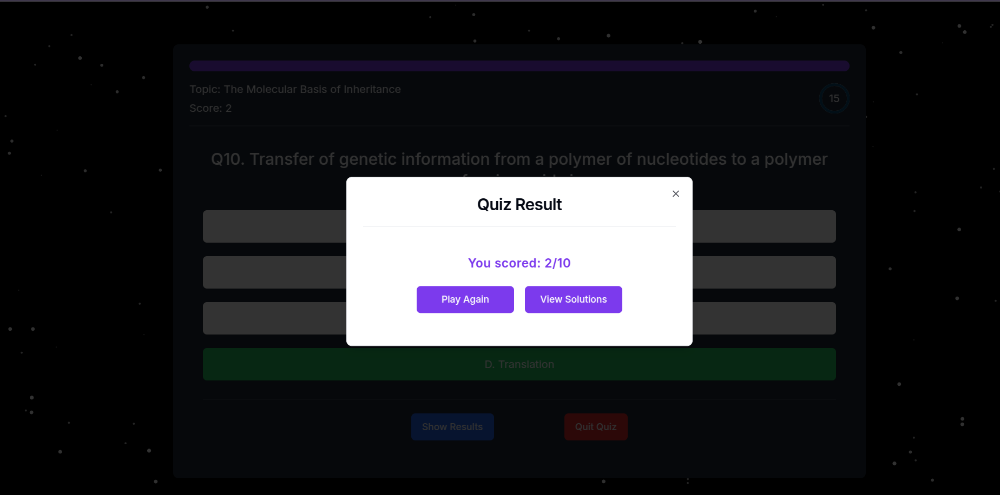
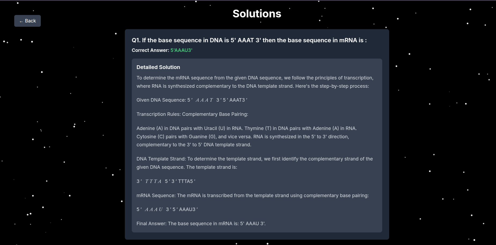

# Quizzzzz Application 🗿

[https://quiz-app-main-delta.vercel.app](https://quiz-app-main-delta.vercel.app/)

My Portfolio : [https://faraz-portfolio-seven.vercel.app/](https://faraz-portfolio-seven.vercel.app/)

Welcome to the Quizzzzz App! Just a Dumb Quizzzzz app 🗿.

## Table of Contents 🗿

- [Demo](#demo)
- [Features](#features)
- [Tech Stack](#tech-stack)
- [API](#api)
- [Getting Started](#getting-started)

## Demo 🗿

Check out the live demo of the Quiz App [(https://quiz-app-main-delta.vercel.app](https://quiz-app-main-delta.vercel.app/)).

Video Link : [https://youtu.be/k22ecmBJ4Qo](https://youtu.be/k22ecmBJ4Qo)








## Features 🗿

- Interactive quizzes with multiple choice questions
- Real-time feedback on answers
- Score tracking and result display
- Responsive design for all devices

## Tech Stack 🗿

- **Framework**: [Next.js 14](https://nextjs.org/)
- **Styling**: [TailwindCSS](https://tailwindcss.com/)
- **Language**: [TypeScript](https://www.typescriptlang.org/)
- **State Management**: [Zustand](https://zustand-demo.pmnd.rs/)
- **UI Components**: [Shad CN/UI](https://ui.shadcn.com/)

## Getting Started 🗿

To get a local copy up and running, follow these simple steps.

### Prerequisites 🗿

Ensure you have the following installed:

- [Node.js](https://nodejs.org/) (v14 or later)
- [npm](https://www.npmjs.com/) or [yarn](https://yarnpkg.com/)

### Installation 🗿

1. Clone the repository

   ```sh
   git clone https://github.com/Faraz-Khan-79996/Quiz-App-main.git
   ```
2. Navigate to the project directory

   ```sh
   cd Quiz-App-main
   ```
3. Install dependencies

   ```sh
   npm install
   ```

   or

   ```sh
   yarn install
   ```

### Usage 🗿

1. Start the development server

   ```sh
   npm run dev
   ```

   or

   ```sh
   yarn dev
   ```
2. Open [http://localhost:3000](http://localhost:3000) with your browser to see the app in action.

### Building for Production 🗿

To create a production build, run:

```sh
npm run build
```

or

```sh
yarn build
```
